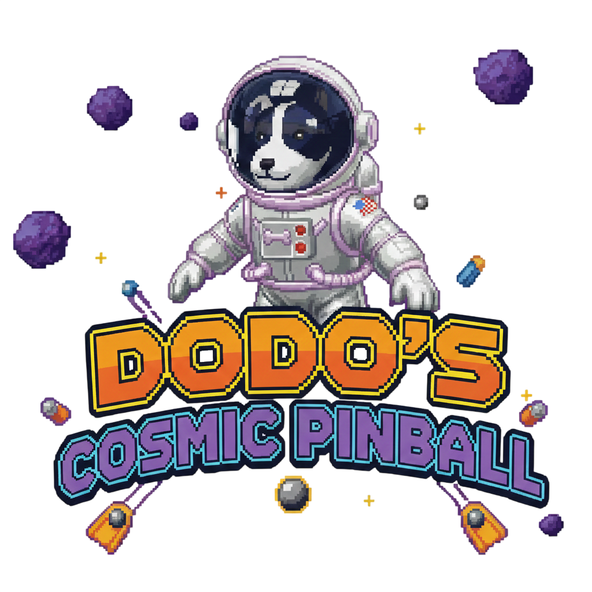

# Dodo's Cosmic Pinball

<p align="center">
  
</p>

<p align="center">
  A 3D pinball game built with Three.js and Rapier physics engine, featuring a space-themed adventure with a dodo astronaut!
</p>

---

## Features

- **Full 3D Graphics** - WebGL-powered rendering with Three.js
- **Realistic Physics** - Rapier 3D physics engine for authentic pinball feel
- **Space Theme** - Cosmic environment with planets, stars, and animated decorations
- **Scoring System** - Points, multipliers, and high score tracking
- **Responsive Controls** - Keyboard and touch input support
- **Procedural Audio** - Dynamic sound effects generated with Web Audio API
- **Post-Processing Effects** - FXAA, bloom, and cinematic lighting

## Screenshots

<p align="center">
  
  <br>
  <em>Gameplay view with flippers and bumpers</em>
</p>

<p align="center">
  
  <br>
  <em>Start screen with controls</em>
</p>

> **Note**: To add screenshots, create a `screenshots` folder and add your images there.

## Getting Started

### Prerequisites

- [Node.js](https://nodejs.org/) (v18 or higher recommended)
- npm (comes with Node.js)

### Installation

1. **Clone the repository**
   ```bash
   git clone https://github.com/yourusername/DodoPinball.git
   cd DodoPinball
   ```

2. **Install dependencies**
   ```bash
   npm install
   ```

3. **Start the development server**
   ```bash
   npm run dev
   ```

4. **Open in browser**

   Navigate to [http://localhost:5173](http://localhost:5173)

### Build for Production

```bash
npm run build
```

The production files will be generated in the `dist` folder.

### Preview Production Build

```bash
npm run preview
```

## Controls

| Action | Keyboard | Touch/Mobile |
|--------|----------|--------------|
| Left Flipper | `Z` | Tap left side of screen |
| Right Flipper | `/` | Tap right side of screen |
| Launch Ball | `Space` (hold & release) | Tap bottom of screen |
| Start Game | `Enter` | Tap screen |

## Gameplay

- **3 balls** per game
- Hit **bumpers** for points (200, 400, or 600 points each)
- Knock down all **5 drop targets** to increase your **multiplier** (up to 5x)
- Earn an **extra ball** at 50,000 points
- Your **high score** is saved automatically

## Tech Stack

| Technology | Purpose |
|------------|---------|
| [Three.js](https://threejs.org/) | 3D rendering |
| [Rapier](https://rapier.rs/) | Physics simulation |
| [Vite](https://vitejs.dev/) | Build tool & dev server |
| [TypeScript](https://www.typescriptlang.org/) | Type-safe development |
| [postprocessing](https://github.com/pmndrs/postprocessing) | Visual effects |

## Deploying to Vercel

### Option 1: Deploy via Vercel Dashboard (Recommended)

1. **Push your code to GitHub**
   ```bash
   git add .
   git commit -m "Ready for deployment"
   git push origin main
   ```

2. **Import to Vercel**
   - Go to [vercel.com](https://vercel.com) and sign in
   - Click **"Add New..."** → **"Project"**
   - Select your GitHub repository
   - Vercel will auto-detect Vite settings

3. **Configure (if needed)**
   - Framework Preset: `Vite`
   - Build Command: `npm run build`
   - Output Directory: `dist`

4. **Deploy**
   - Click **"Deploy"**
   - Your game will be live in seconds!

### Option 2: Deploy via Vercel CLI

1. **Install Vercel CLI**
   ```bash
   npm install -g vercel
   ```

2. **Login to Vercel**
   ```bash
   vercel login
   ```

3. **Deploy**
   ```bash
   vercel
   ```

   For production deployment:
   ```bash
   vercel --prod
   ```

### Vercel Configuration (Optional)

Create a `vercel.json` file in the project root for custom settings:

```json
{
  "buildCommand": "npm run build",
  "outputDirectory": "dist",
  "framework": "vite"
}
```

## Project Structure

```
DodoPinball/
├── src/
│   ├── main.ts              # Entry point
│   ├── game/                # Game logic & state
│   ├── entities/            # Game objects (Ball, Flipper, Bumper, etc.)
│   ├── physics/             # Rapier physics setup
│   ├── rendering/           # Three.js scene & effects
│   ├── table/               # Table layout & construction
│   ├── input/               # Keyboard & touch handling
│   ├── audio/               # Sound effects & music
│   └── ui/                  # HUD & screens
├── public/
│   └── assets/              # Models, sounds, images, fonts
├── styles/
│   └── main.css             # UI styling
└── package.json
```

## Development

### Adding New Features

- **New entities**: Add to `src/entities/` following the `Entity` base class pattern
- **New sounds**: Add to `src/audio/AudioManager.ts` or place audio files in `public/assets/sounds/`
- **New 3D models**: Place FBX files in `public/assets/models/` and import in the relevant entity

### Game Constants

Tune gameplay in `src/game/constants.ts`:
- Ball physics (size, speed, restitution)
- Flipper properties (length, force)
- Scoring values and multipliers

## License

This project is for educational purposes.

## Acknowledgments

- Three.js community for excellent documentation
- Rapier physics engine for WASM-powered physics
- The dodo bird, for being awesome

---

<p align="center">
  Made with ❤️ and physics
</p>
